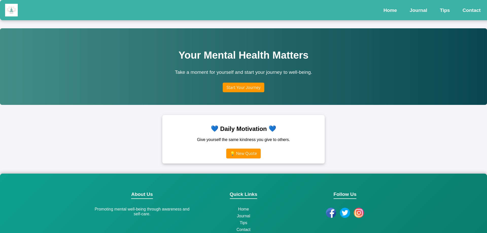
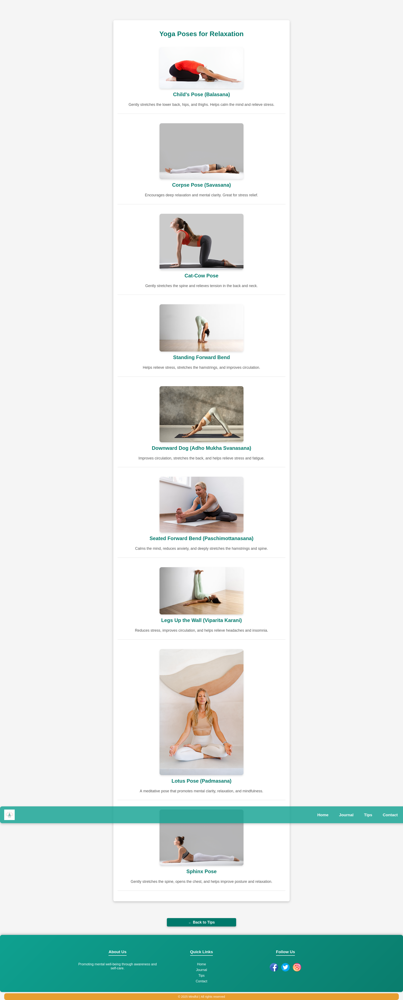
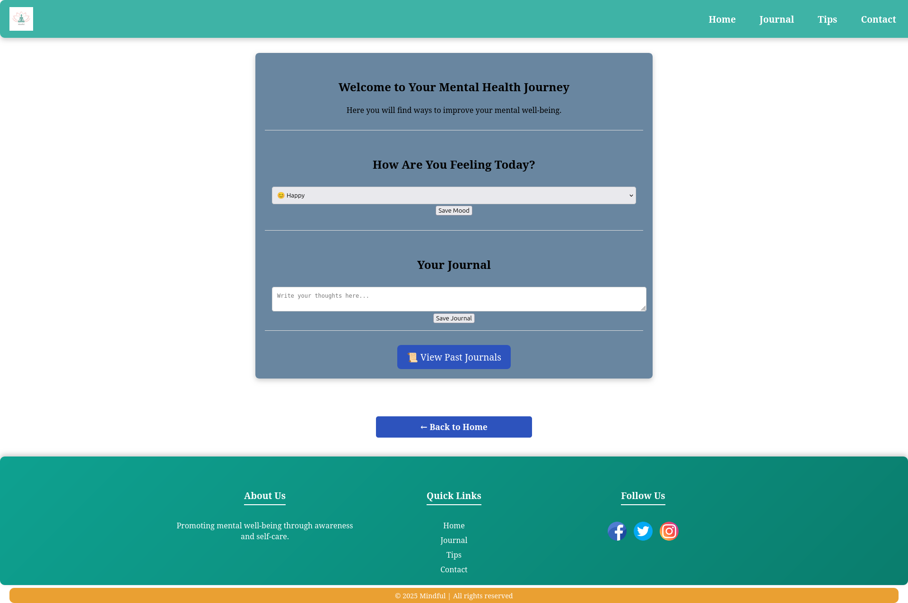

  

<h1 align="center"> Mental Wellness Landing Page</h1>

A peaceful, supportive website for daily motivation, yoga, journaling, and mood tracking – built with HTML, CSS, and JavaScript.

---

##  About the Project

This project is a simple mental health landing page that promotes well-being through calm design and useful features. Whether you're looking to stretch, write out your thoughts, or just get inspired, this page is here for you.

---

##  Features

-  **Daily Motivational Quotes** – Randomly served positive messages
-  **Yoga Exercise Section** – Beginner-friendly poses to stretch & breathe
-  **Journaling Section** – Write your thoughts in a private space
-  **Mood Tracker** – Track how you're feeling over time (optional/future)
-  **Minimal, Calming UI** – Soft colors and user-friendly layout

---

##  Built With

- **HTML5** – Structure of the website
- **CSS3**   – Styling and layout (responsive, calming design)
- **JavaScript** – JavaScript – Interactive features (quotes, journal, mood tracking)

---

##  Screenshots

###  Home / Motivation Section

###  Yoga Exercises

###  Journaling Area

---

License

This project is licensed under the MIT License.
See LICENSE for details.

 Contact

Created with care by Maham Sajid
mahamsajid450@gmail.com